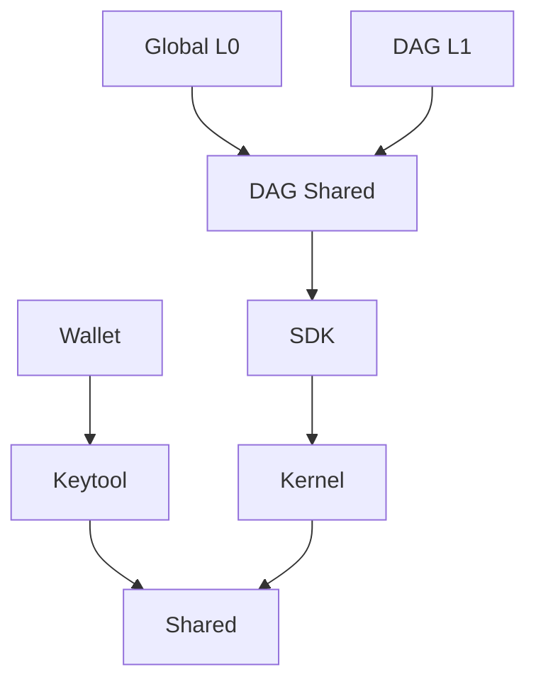

# 12. Структура модулей

Существующая структура модулей Shiwa была смешанной и трудно поддерживаемой.

- `shared` содержит как расширения библиотеки, так и схему Shiwa,
- `keytool` содержит генератор ключевых пар и предоставляет операции, связанные с ключами,
- `wallet` содержит операции, связанные с созданием транзакций (но также некоторые части, которые должны быть общими для других модулей),
- `kernel` содержит часть каналов состояния (идея гиломорфизма),
- `sdk` содержит все, что общее между Global L0 и DAG L1, но не сам $SHI,
- `dag-shared` содержит все, что общее между Global L0 и DAG L1, относящееся к $SHI,
- `core` является модулем Global L0 (но также содержит каналы состояния, которые должны быть извлечены для повторного использования в других модулях),
- `dag-l1` является модулем SHI DAG L1 ($SHIDAG token Layer 1).

Кроме того, зависимости были частично явно объявлены и частично переходящими. Через некоторое время это стало неподдерживаемым.

Второй (и главной) причиной перестройки модулей является тот факт, что сторонние разработчики не могут использовать модуль SDK в текущей форме. Он не предоставляет все необходимые операции, поэтому внутренние модули использовались напрямую, раскрывая внутреннюю структуру проекта и ограничивая дальнейшие внутренние изменения.

## Решение

Модуль `keytool` будет разделен на: операции/функции, которые мы поместим в `shared`, и экспонирующее приложение, которое будет объединено в модуль `wallet`.
Затем все, что относится к операциям узла, будет сохранено в модуле `node-shared` (включая протокол gossip, консенсус и т. д.). Э